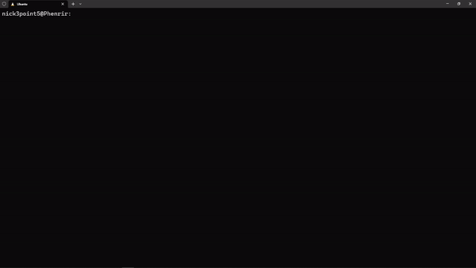

<h1 align="center" style="border-bottom: none;">Emmet-Gen</h1>
<h3 align="center">
An un-opinionated file template CLI system that works with syntax inspired by a <a href="https://emmet.io/">
Emmet
</a>
</h3>
<p align="center">
 <a href="https://www.npmjs.com/package/emmet-gen" target="_blank">
  
 </a>
 <a href="https://github.com/nick3point5/emmet-gen/tree/main" target="_blank">
  
 </a>
 <a href="https://github.com/nick3point5" target="_blank">
  
 </a>
</p>
<p align="center">
  
</p>

---

# Getting started

## Installation

* Download and install [Node.js](https://nodejs.org/en/download/).
* Before emmet-gen can be used, it should be initialized with the command

```shell
npx emmet-gen init
```

* emmet-gen can be used in any sub-directory. emmet-gen will search up the file tree for <b>emmet-gen-template.json</b>.

---

# Usage

## Templates

* Emmet-gen will use the templates in the emmet-gen-template directory.
* Every directory at the top level of the `emmet-gen-template` is a template route.
* The name of the template will be the name used as a class or id.
* Any name or text within a file with `__TemplateName__` will be replaced by the tag of the template.
* Each template must contain exactly 1 directory or file at the top.
* Directories can have any amount of files and subdirectories.

## Commands

### Emmet

* Emmet-gen with parse a string argument with emmet-like syntax.
* It should be noted depending on your terminal shell you will have to escape some special characters.
* Here are the following syntax supported by emmet-gen using bash.

#### Child: >

  makes the following tag a child

```shell
npx emmet-gen hello\>world
```

#### Sibling: +

  add the following tag as a sibling

```shell
npx emmet-gen hello+world
```

#### Climb-up: ^

  directs the following tag up the tree

```shell
npx emmet-gen hello\>to+the^world
```

#### Item numbering: $

#### Multiplication: *

  multiplies a tag
<b>NOTE: items multiplied must have \$ numbering to prevent overwriting each other</b>

```shell
npx emmet-gen hello\>world\$\*5
```

#### ID: \#

  sets the template of the preceding tag

```shell
npx emmet-gen hello\>world#file
```

#### CLASS: .

  sets the template of the preceding tag and subsequent templates.

```shell
npx emmet-gen hello.file
```

#### Replace Contents: [target="substitute"]

  replaces target text within a file with the substitute text
<b>NOTE: substitute must be wrapped in double quotes</b>

```shell
npx emmet-gen hello[log=\"error\"]
```

#### empty: /

  mark the following tag as an empty directory. If chained a tag will make the directory a child. Empty tags will not influence the template inheritance.

```shell
npx emmet-gen /hello/world
```

#### Grouping: ()  

wraps tags. Can be used with multiply.

```shell
npx emmet-gen hello\>\(to\$+the\$+world\$\)\*5
```

<br/>

* emmet commands will by default create templates relative terminal's working directory.
* This can be changed in the emmet-gen-template.json by ```"relative": false,``` and the default directory will be absolutely bound to the directory which contains the emmet-gen-template.json

---

### Index

* emmet-gen also can be used to generate index files using es6 importing syntax for JavaScript/Typescript files.
* If a path isn't specified, emmet-gen will use the current working directory.

```shell
npx emmet-gen index ./hello
```

* The --recursive or -r flag can be used to recursively generate index files.

```shell
npx emmet-gen index ./hello -r
```

* For emmet commands, the --index or -i flag can be used to recursively generate index files for templates.

```shell
npx emmet-gen hello\>\(to\$+the\$+world\$\)\*5 -i
```

* Index files with be generated without the flag by changing the emmet-gen-template.json by ```"auto_imports": true,```

### Init

* Emmet-gen templates can be saved and retrieved from a local JSON file.
* The --save or -s flag with create an ```emmet-save.json``` with data of your templates and emmet-gen-templates.json in the same directory as the ```emmet-gen-template.json```.

```shell
npx emmet-gen init -s
```

* The --load or -l flag with read ```emmet-save.json``` and generate templates and emmet-gen-templates.json in the working directory.

```shell
npx emmet-gen init -l
```

* Emmet-gen also supports remote cloud saving and loading as well.
* Adding a name after the save flag will upload the templates.
<b>NOTE: Every template name uploaded is unique and uploading with the same name will overwrite the previous template.</b>

```shell
npx emmet-gen init -s nick3point5-example
```

* Similarly loading from the cloud will be done if a name is provided.

```shell
npx emmet-gen init -l nick3point5-example
```
